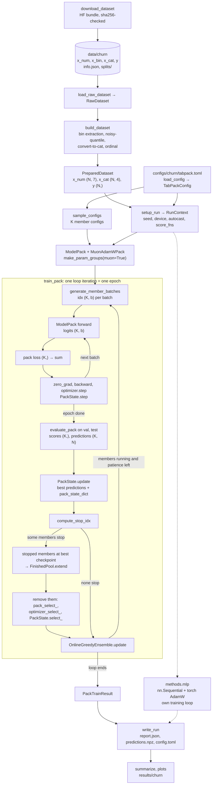
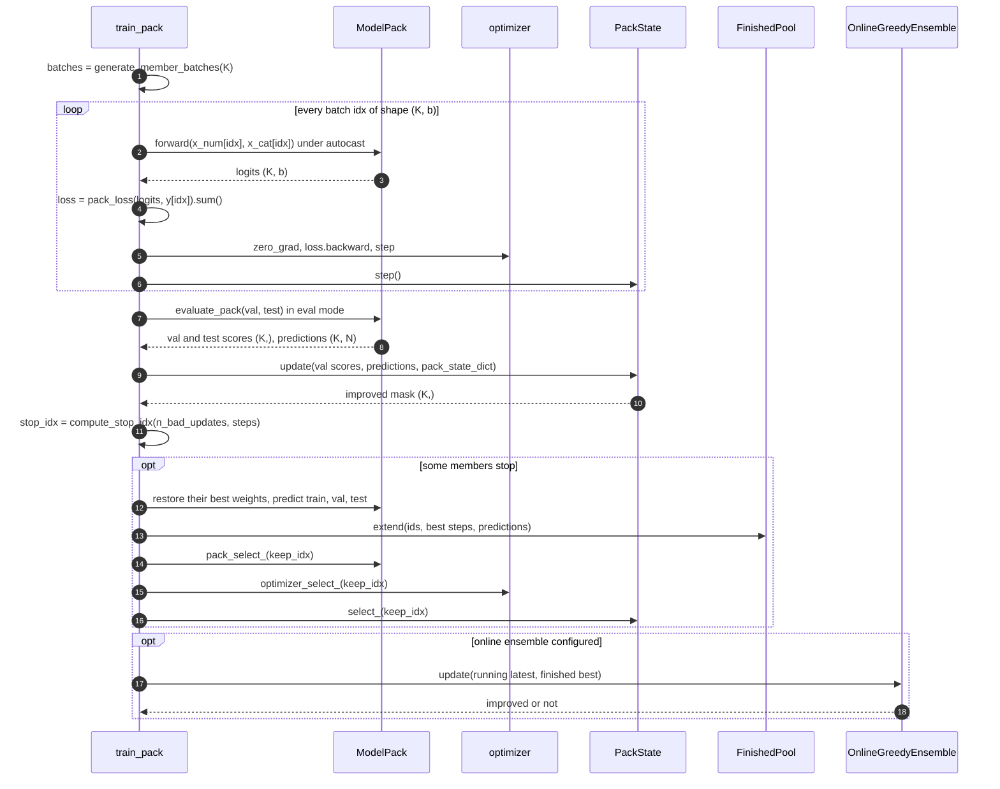

# Architecture

A guide to the codebase for new contributors. It describes contracts and semantics;
the docstrings in `src/tabpack_repro/**` are authoritative when this page and the
code disagree.

Related documents:

* [EXPERIMENT.md](EXPERIMENT.md): the compared methods, their settings and results.
* [REPRODUCIBILITY.md](REPRODUCIBILITY.md): seeds, determinism, hardware, how to rerun.
* [DEVELOPMENT.md](DEVELOPMENT.md): day-to-day workflow (tests, lint, CI).
* [AGENTS_PROTOCOL.md](AGENTS_PROTOCOL.md): how the parallel agents built this repo.

Contents:

1. [What TabPack is](#1-what-tabpack-is)
2. [Repository layout](#2-repository-layout)
3. [The pack abstraction](#3-the-pack-abstraction)
4. [Data flow](#4-data-flow)
5. [One epoch of the training loop](#5-one-epoch-of-the-training-loop)
6. [Per-member hyperparameters](#6-per-member-hyperparameters)
7. [The online greedy ensemble](#7-the-online-greedy-ensemble)
8. [How the three methods reuse the machinery](#8-how-the-three-methods-reuse-the-machinery)
9. [Parity with the official code](#9-parity-with-the-official-code)
10. [Differences from the official implementation](#10-differences-from-the-official-implementation)

## 1. What TabPack is

TabPack ([arXiv:2607.05380](https://arxiv.org/abs/2607.05380)) is an efficient
ensemble of MLPs that have *different* model and optimizer hyperparameters. One run
samples `K` member configurations from a search space (depth, dropout, learning
rates, weight decay) and trains all `K` MLPs simultaneously as a single *pack*: every
layer is a batched matmul over a leading pack dimension, and one optimizer step
updates every member with its own hyperparameters. Each member early-stops on its own
validation score and then leaves the pack, so the pack shrinks during training. On
the fly, after every epoch, a greedy ensemble (Caruana et al., 2004) is rebuilt from
the validation predictions of finished and still-running members; training ends when
every member has finished or when this online ensemble has not improved for
`patience` epochs. This repository reproduces a reduced version (32 members, ensemble
of at most 16) on the Churn dataset and compares it with an ordinary MLP and a
homogeneous MLP ensemble (see [EXPERIMENT.md](EXPERIMENT.md)).

## 2. Repository layout

| Path | Content |
| :-- | :-- |
| `src/tabpack_repro/types.py` | `PACK_DIM`, `BATCH_DIM`, `PartKey`, `TaskType`, `PredictionType`; the tensor-layout conventions |
| `src/tabpack_repro/config.py` | Dataclass configs of every method (single source of truth for knobs); TOML load/dump |
| `src/tabpack_repro/data/` | Download, raw loading, numerical/categorical preprocessing, `PreparedDataset` |
| `src/tabpack_repro/nn/` | `LinearPack`, `DropoutPack`, `MLPBackbonePack`, `ModelPack`, member removal (`pack_ops`) |
| `src/tabpack_repro/optim/` | Newton-Schulz, `AdamWPack`, `MuonAdamWPack`, parameter groups, `optimizer_select_` |
| `src/tabpack_repro/training/` | Batches, losses, `PackState`, evaluation, early stopping, `FinishedPool`, `train_pack` |
| `src/tabpack_repro/ensembles/` | `average_predictions`, `greedy_ensemble`, `OnlineGreedyEnsemble` |
| `src/tabpack_repro/metrics.py` | `compute_metrics` (numpy, one prediction); `score_pack` / `make_score_fn` (torch, batched) |
| `src/tabpack_repro/sampler.py` | Sampling member configs from the official `_tune_` search-space format (optuna) |
| `src/tabpack_repro/methods/` | `mlp`, `homogeneous`, `tabpack`, `conservative`; `common.py` (setup, reports); `report.py` (report schema) |
| `src/tabpack_repro/reporting/` | Summaries across seeds, plots, extraction of the official Churn numbers |
| `src/tabpack_repro/utils/` | Seeding, device and autocast, JSON I/O, git commit lookup |
| `src/tabpack_repro/cli.py` | The `tabpack-repro` command (`download`, `run`, `conservative`, `summarize`, `reference`) |
| `configs/churn/` | One TOML file per method |
| `scripts/` | `run_churn.py` / `run_churn.sh` (the full experiment), `benchmark_pack.py` |
| `tests/` | Unit tests mirroring `src/`; `tests/parity/` (official code), `tests/integration/` (end-to-end, determinism, pack invariants) |
| `results/` | `reference/` (official Churn numbers), `churn/` (summaries), `benchmark/` |
| `runs/` | Run directories (`report.json`, ...); `*.npz` and `*.pt` are git-ignored |
| `data/` | Git-ignored dataset root (`$TABPACK_DATA_DIR` overrides it) |
| `docs/`, `evidence/`, `tools/` | Documentation; provenance of the multi-agent build; dev runner, board, evidence scripts |
| `.reference/tabpack` | Git-ignored clone of the official code (commit `05a89e2`), used only by parity tests |

Import layering (lower layers never import higher ones):
`types`, `config` -> `data` -> `metrics` -> `nn` -> `optim` -> `ensembles` ->
`training` -> `methods` -> `cli`, with `utils` and `reporting` on the side.

## 3. The pack abstraction

### Tensor layout: `(K, B, d)`

A *pack* is `K` independent MLPs evaluated with batched tensor ops. The conventions of
`types.py` hold everywhere:

* The pack dimension comes first: `PACK_DIM = 0`. Activations are `(K, B, d)`, with
  `BATCH_DIM = 1`.
* `LinearPack` stores `weight` as `(K, in, out)` and `bias` as `(K, out)`; its forward
  pass is one `baddbmm` (`x @ weight + bias`) for all members.
  `forward(x, member_idx)` applies only the members `member_idx`
  (`K' = len(member_idx)`) using `weight[member_idx]`.
* Inputs enter `ModelPack.forward(x_num, x_cat)` in one of two forms:
  * **training**: per-member batches `(K, b, f)`, because every member reads its own
    rows. The batch indices are an int64 `(K, b)` tensor, so `x_num[idx]` is
    `(K, b, f)` directly;
  * **evaluation**: shared rows `(B, f)`, expanded to `(K, B, f)` without copying.
* Logits are `(K, B)` for binary classification (Churn), `(K, B, C)` for multiclass.
  Predictions are stored in aggregation-friendly units: probabilities `(K, N)` for
  binclass, `(K, N, C)` for multiclass, labels for regression; never raw logits.

For Churn, one training batch flows as follows (`K = 32`, `b = 256`):
`x_num (32, 256, 7)` and `x_cat (32, 256, 4)` -> one-hot `(32, 256, 9)` -> concat
`(32, 256, 16)` -> backbone `(32, 256, 384)` -> head `(32, 256, 1)` -> logits
`(32, 256)`.

### Member ids versus pack positions

Two different indices identify a member:

* its **id** (`0..n_models-1`), assigned at creation and never reused. It indexes the
  member configs and appears in reports and in the ensemble;
* its **pack position** (`0..K-1`), its current row along dim 0. Positions are
  renumbered every time members leave the pack.

`PackState.ids` maps positions to ids. Every per-member array in the trainer
(`steps`, `n_bad_updates`, best scores, predictions) is indexed by position.

### The pack invariant

> Every `nn.Parameter` and every buffer of a pack module has `shape[0] == K`.

This includes per-member *hyperparameters* stored as buffers: `DropoutPack.p` is a
float32 `(K,)` buffer and `MLPBackbonePack.n_blocks` an int64 `(K,)` buffer. Modules
without state (activations, `OneHotEncoding`) trivially satisfy it. Consequences:

* `get_pack_size(module)` is well defined (and checks that all tensors agree);
* `pack_size` properties are derived from tensor shapes, never cached, and no module
  caches anything derived from per-member buffers across forward calls;
* a per-member checkpoint is just `pack_state_dict(module)` (detached clones of all
  params and buffers); restoring members is `pack_load_members_(module, state, idx)`,
  an in-place row copy;
* removing members is a slice along dim 0 of every tensor.

`tests/integration/test_pack_invariants.py` checks the invariant for the model, the
optimizer state and `PackState` across member removals.

### Member removal is a dim-0 slice

When members stop, the trainer computes the sorted positions to keep
(`make_keep_idx`) and applies the same `keep_idx` to three objects:

1. `nn.pack_ops.pack_select_(model, keep_idx)`: for every parameter,
   `param.data = param.data[keep_idx]` and `param.grad = None`; buffers are replaced
   by their slices.
2. `optim.pack_utils.optimizer_select_(optimizer, keep_idx)`: slices every optimizer
   state tensor whose dim 0 is the old `K` (`exp_avg`, `exp_avg_sq`, Muon momentum,
   per-member step counters) and every `(K,)` hyperparameter in the param groups
   (`lr`, `weight_decay`, `muon_lr`, `muon_scale`). Scalars are left untouched.
3. `PackState.select_(keep_idx)`: slices ids, counters, best predictions and the best
   checkpoint.

**Why the parameter identity must be preserved.** A `torch.optim.Optimizer` refers to
parameters by object: `param_groups[i]['params']` holds the `Parameter` objects and
`optimizer.state` is a dict keyed by them. Replacing a parameter with a new object
would leave the optimizer stepping the old, full-size tensor. Assigning to
`param.data` swaps the storage behind the same object, so the param groups and the
state keys stay valid, and only the state *values* need slicing (step 2). The
official code instead creates new parameter objects and remaps the optimizer with an
`old_to_new` dictionary (see
[section 10](#10-differences-from-the-official-implementation)).

Removal is only legal between optimizer steps, when no autograd graph that used the
parameters is alive: autograd caches the parameter shape, so a backward pass through
a graph built before the slice fails. The trainer removes members after
`optimizer.step()` and after the no-grad evaluation.

## 4. Data flow

The flowchart shows a TabPack run. The homogeneous ensemble takes the same path
without the sampler and without the online ensemble. The plain MLP (dashed) shares
only the data pipeline and the report format.



Data details (all mirroring the official Churn pipeline, see `data/*.py`):

* Churn has 10,000 rows split 6,400 / 1,600 / 2,000 (train / val / test), 7
  numerical, 3 binary and 1 categorical feature.
* No numerical column has exactly two values, so `extract_bin_from_num` moves
  nothing. The noisy-quantile transform (seed 0, independent of the run seed) is fit
  on train. The 3 binary features are converted to categorical and appended after
  the original one, then everything is ordinal-encoded with train cardinalities
  `[3, 2, 2, 2]`. `OneHotEncoding` turns those codes into 9 columns inside the model,
  so the MLP input width is `7 + 9 = 16`. Unknown val/test categories get a code
  `>= cardinality` and encode to all zeros.
* `PreparedDataset` holds CPU tensors; `setup_run` moves it to the device once, and
  all batching is done with device-side index tensors.

## 5. One epoch of the training loop

`training.trainer.train_pack` is shared by the homogeneous ensemble and TabPack.



Step by step, with the semantics each piece is responsible for:

1. **Batches** (`generate_member_batches`): every member gets its own random
   permutation of the train rows, drawn from a `torch.Generator` on the model device
   seeded with the run seed:
   `torch.rand((K, N)).argsort(dim=1).split(batch_size, dim=1)`. An epoch is
   `ceil(N / batch_size)` batches (25 for Churn); the last batch may be smaller.
2. **Forward** under autocast (bfloat16 on CUDA, none on CPU). Each member only ever
   sees its own rows; there is no cross-member interaction anywhere in the model.
3. **Loss** (`make_pack_loss`): per-member mean loss, a `(K,)` vector (BCE with
   logits for Churn). The trainer backpropagates the **sum**, not the mean: member
   `k`'s gradient is then exactly the gradient of its own mean loss, independent of
   `K`.
4. **Step**: one `optimizer.step()` updates all members with their own
   hyperparameters ([section 6](#6-per-member-hyperparameters)); `PackState.step()`
   counts steps per member.
5. **Evaluate** (`evaluate_pack`): all members on val and test in eval mode, with
   shared inputs. Predictions are probabilities `(K, N)`, scores `(K,)` come from the
   batched `score_pack` (accuracy for Churn, higher is better). On CUDA OOM the eval
   batch size is halved and the call retried.
6. **Update state** (`PackState.update`): a member *improves* iff its val score is
   strictly greater than its best so far (the first evaluation always improves).
   Improved members copy their current predictions and weights into
   `best_predictions` / `best_model_state` and reset `n_bad_updates`; the others
   increment it.
7. **Early stopping** (`compute_stop_idx`): stop member `k` if
   `n_bad_updates[k] > patience` (with `patience = 16`, after 17 consecutive
   non-improving epochs), or if `max_epochs >= 0` and it has trained that many epochs
   (`max_epochs = -1`: no limit).
8. **Finish** stopped members: restore their best weights, predict train, val and
   test, and append ids, best steps and predictions to the `FinishedPool` (ordered by
   finishing time). Then remove them from model, optimizer and state
   ([section 3](#member-removal-is-a-dim-0-slice)). The remaining members' current
   predictions are their *latest* predictions for the ensemble.
9. **Online ensemble** (TabPack only): `update` with the running members' latest
   predictions and the finished members' best predictions
   ([section 7](#7-the-online-greedy-ensemble)). The trainer appends one history row
   per epoch (step, time, running and finished counts, train loss, ensemble val and
   test scores).

The loop runs while at least one member is running and, if there is an online
ensemble, while it `is_running`. When the ensemble's patience runs out, members still
in the pack are dropped: they are not in `PackTrainResult.members` (their snapshots
may still be part of the ensemble). This is the official behaviour; the official
64-member Churn run ended with 57 finished members.

## 6. Per-member hyperparameters

TabPack samples, per member, `n_blocks` in `[1, 4]`, `dropout` (0 with probability
1/2, else uniform in `[0, 0.5]`), and log-uniform `lr`, `weight_decay` and `muon_lr`
(the official Churn space, `config._official_space`). `d_block = 384` and the
activation (ReLU) are shared. Each hyperparameter becomes a `(K,)` tensor.

### Depth: `n_blocks`

`MLPBackbonePack` builds `max(n_blocks)` blocks (Linear -> activation -> dropout),
each a full pack of `K` members. Member `k` applies only its first `n_blocks[k]`
blocks:

* blocks where every member is active run on the whole pack;
* for a partially used block `i`, the active members `{k : n_blocks[k] > i}` are
  computed from the `n_blocks` buffer on every forward call (never cached, since the
  pack shrinks); their rows are gathered with `index_select`, the block runs with
  `member_idx` set to them, and the results are written back with `index_copy`;
* blocks that no member uses any more are skipped;
* the other members pass through unchanged. This is why `d_block` must be shared:
  every block after the first maps `d_block -> d_block`, so skipping one keeps shapes
  aligned, and the head always receives `(K, B, d_block)`.

Members that skip a block receive exactly zero gradient from that block's weights.
Their unused weight slices are still shrunk by decoupled weight decay, which is
harmless because they never influence an output. A block that no running member uses
any more gets no gradient at all (`grad is None`), so the optimizers skip it.

### Dropout

`DropoutPack` stores a float32 `(K,)` buffer `p`, the same rate in every block of a
member. In training mode the mask is `Bernoulli(1 - p_k)` element-wise, scaled by
`1 / (1 - p_k)`; members with `p_k = 0` must come out bit-for-bit unchanged. In eval
mode it is the identity.

### Optimizer hyperparameters as `(K,)` tensors

The optimizers (`AdamWPack`, `MuonAdamWPack`) accept `lr`, `weight_decay` and
`muon_lr` as a Python float (same for all members) or a sequence of `K` values. The
latter is stored in each param group as a float32 `(K,)` tensor on the parameters'
device, with separate storage per group, and broadcast over the trailing dims (a
`(K, in, out)` weight sees `(K, 1, 1)`, a `(K, out)` bias sees `(K, 1)`). Every
update is exactly the single-model update applied member by member:

* AdamW (matches `torch.optim.AdamW` per member):
  `p <- p * (1 - lr_k * wd_k)`, Adam moments, bias-corrected step of size `lr_k`.
* Muon (per `(K, in, out)` weight):
  `p <- p * (1 - muon_lr_k * wd_k)`; momentum buffer and Nesterov lookahead;
  Newton-Schulz orthogonalization of each member's matrix (batched over `K`, in
  bfloat16); scale by `muon_scale_k`; `p <- p - muon_lr_k * u`.

With `shared_step=True` the bias-correction step `t` is one Python int. This is exact
rather than an approximation: members only ever leave a pack, never join it, so all
running members have taken the same number of steps.

### Parameter groups: Muon versus AdamW

`optim.pack_utils.make_param_groups(model, muon=...)` builds the groups:

| Group | Parameters | Update | Weight decay |
| :-- | :-- | :-- | :-- |
| Muon (`muon=True` only), one per backbone block | `blocks[i].linear.weight`, `(K, in, out)` | Muon with `muon_lr`, `muon_scale = sqrt(max(1, out / in))` as a `(K,)` tensor | per-member `wd_k` |
| Default | head weight; also the backbone weights when `muon=False` | AdamW with `lr` | per-member `wd_k` |
| No-decay | every bias, `(K, d)` | AdamW with `lr` | `0.0` (a float) |

For Churn, `muon_scale` is `sqrt(384 / 16) ≈ 4.9` for the first block and `1` for the
hidden blocks. TabPack uses `MuonAdamWPack` with per-member tensors; the homogeneous
ensemble uses `AdamWPack` with `muon=False` and plain floats (`lr = 1e-3`,
`weight_decay = 1e-4`).

## 7. The online greedy ensemble

### Greedy selection

`ensembles.greedy.greedy_ensemble(predictions, score_fn, max_ensemble_size)` is
Caruana-style forward selection **without replacement** over the rows of an
`(M, N)` prediction tensor:

1. start from the single best row (first maximum of the individual scores);
2. for every unused row, score the candidate average
   `mean * s / (s + 1) + row / (s + 1)`, where `s` is the current size;
3. if the best candidate is not strictly better than the current ensemble, or the size
   limit is reached, stop; otherwise add it (ties between best candidates go to the
   best individual score, first maximum) and repeat.

It returns sorted row indices; the ensemble prediction is their uniform average.

### Online updates

`OnlineGreedyEnsemble` (official `update_type='latest'`,
`include_current_ensemble_in_pool=True`, selection on val) keeps the current
ensemble as a list of *snapshots* `(id, step, predictions for val and test)`. After
every epoch:

* **Pool** = the current ensemble's snapshots, then the finished members at their
  best epoch, then the running members at their *latest* epoch. The pool is a list
  of entries, not a set of ids: one member can appear several times (an older
  snapshot held by the ensemble and its newest one), and the same snapshot can appear
  twice (held by the ensemble and, once the member has finished, in the finished
  pool).
* **Candidate** = `greedy_ensemble` on the pool's val predictions, with
  `max_ensemble_size` (16 here).
* **Acceptance**: the candidate replaces the current ensemble only if its val score
  is strictly higher (the first update is always accepted). On acceptance the
  selected entries' ids, steps and val/test predictions are stored and the remaining
  patience is reset to `patience` (32 here); otherwise it decreases by one.
* **Termination**: `is_running` becomes False once the remaining patience drops below
  zero, i.e. after `patience + 1` consecutive rejected updates, and `train_pack`
  stops.

Strict acceptance makes the ensemble's val score non-decreasing. Keeping the current
ensemble in the pool matters because running members contribute only their latest
snapshot: without it, a good older snapshot of a member that has since overfitted
could not be selected again. Because selection is over entries, a duplicated
snapshot acts as weight 2 in the average; the report therefore records both `size`
and `n_unique`.

### Worked example

Three members A, B, C; `max_ensemble_size = 3`, ensemble `patience = 1`; val
accuracy. `X@e` is member X's snapshot after epoch `e`. C early-stops after epoch 2
with its best checkpoint at epoch 1; A and B keep training.

| Epoch | Pool (current / finished / running latest) | Greedy result (val) | Decision | Remaining patience |
| :-- | :-- | :-- | :-- | :-- |
| 1 | – / – / A@1 .80, B@1 .82, C@1 .79 | B@1 (.82); +A@1 -> .83; +C@1 -> .825, not better: stop. {A@1, B@1} = .83 | first update: accept | 1 |
| 2 | {A@1, B@1} / C@1 (stopped, best at epoch 1) / A@2 .81, B@2 .815 | {A@1, B@1} = .83 again | .83 is not > .83: reject | 0 |
| 3 | {A@1, B@1} / C@1 / A@3 .84, B@3 .82 | A@3 (.84); +B@1 -> .85; +C@1 -> .855; size 3: stop | .855 > .83: accept {A@3, B@1, C@1} | 1 |
| 4 | same entries, new latest snapshots | best is .855 or lower | reject | 0 |
| 5 | ... | best is .855 or lower | reject | -1: stop training |

At epoch 3, B@1 is only in the pool because the current ensemble holds it (B's
latest snapshot is B@3). After epoch 5 `train_pack` stops; A and B are dropped
although they were still running, and the final prediction is the average of A@3,
B@1 and C@1.

A real trace: the official 64-member Churn run ended with ids
`[4, 50, 22, 4, 40, 53]` at steps `[225, 225, 125, 225, 775, 775]`, i.e. the same
snapshot of member 4 counted twice.

## 8. How the three methods reuse the machinery

Every method is a `run(config, output_dir)` in `methods/` that calls
`common.setup_run` (seed, device, autocast, dataset on device, score functions),
writes `report.json`, `predictions.npz` and `config.toml` with `common.write_run`, and
follows the schema in `methods/report.py`.

| | Ordinary MLP (`mlp`) | Homogeneous ensemble (`homogeneous`) | Reduced TabPack (`tabpack`) |
| :-- | :-- | :-- | :-- |
| Model | `nn.Sequential`: 3 x (Linear 384, ReLU, Dropout 0.1), head | `ModelPack`, `K = 16`, scalar `n_blocks = 3`, `dropout = 0.1` | `ModelPack`, `K = 32`, sampled `n_blocks`, `dropout` |
| Optimizer | `torch.optim.AdamW`, biases without decay | `AdamWPack`, floats, `make_param_groups(muon=False)` | `MuonAdamWPack`, `(K,)` tensors, `make_param_groups(muon=True)` |
| Loop | its own epoch loop | `train_pack`, no online ensemble | `train_pack` + `OnlineGreedyEnsemble` |
| Members differ by | – | initialization, batch order and dropout masks only | hyperparameters, initialization, batch order |
| Final prediction | the epoch with the best val score | uniform average of all members' best checkpoints | the online greedy ensemble |

`tabpack-conservative` (`methods/conservative.py`) is the paper's conservative
protocol: it takes the sorted unique ids of a finished TabPack run's final ensemble,
looks up their configs, and calls `methods.tabpack.run` with `configs=selected` for
seeds `0..n_seeds-1`, reporting each retraining run's online-ensemble test score.

**The plain MLP is independent on purpose.** It uses no pack module, pack optimizer
or `train_pack`, only the shared data pipeline, metrics and report format. It has the
same hyperparameters as each homogeneous member (and the same batch size, early
stopping and AMP), and `LinearPack` initializes like `nn.Linear`. So the homogeneous
members' individual scores and the plain MLP's scores should come from the same
distribution: a free end-to-end check that the pack machinery (per-member batches,
loss sum, `AdamWPack`, member removal) introduces no cross-member coupling or bias.

## 9. Parity with the official code

The official repository is cloned outside version control at `.reference/tabpack`
(pinned commit `05a89e2`; `$TABPACK_REFERENCE_DIR` overrides the path). It is never
copied into `src/`. Tests in `tests/parity/` import it through the `official` fixture
of `tests/parity/conftest.py`, are marked `parity` automatically, and are skipped when
the clone is missing:

```bash
tools/dev/py -m pytest tests/parity -q
```

| Test file | Our code | Official counterpart |
| :-- | :-- | :-- |
| `tests/parity/test_parity_nn.py` | `nn.LinearPack`, `DropoutPack`, `MLPBackbonePack`, `ModelPack`, `pack_ops` | `project.nn`, `project.tabpack.ModelPack` |
| `tests/parity/test_parity_optim.py` | `optim.zeropower_via_newtonschulz5`, `AdamWPack`, `MuonAdamWPack`, `make_param_groups`, `optimizer_select_` | `vendor.muon`, `project.optim`, `lib.optim.utils.make_parameter_groups` |
| `tests/parity/test_parity_ensemble.py` | `metrics.score_pack`, `greedy_ensemble`, `OnlineGreedyEnsemble` | `project.metrics_torch`, `project.ensemble_utils_torch.greedy_ensemble`, `project.tabpack.OnlineEnsemble` |
| `tests/parity/test_parity_data.py` | `data.build_dataset` and its steps | `lib.data.build_dataset` |
| `tests/parity/test_parity_sampler.py` | `sampler.sample_configs` | `project.tabpack.HyperparameterSampler`, `lib.tools.tune` |

At the results level, `reporting/reference.py` extracts the numbers shipped with the
official Churn reports into `results/reference/churn_official.json`, and the summary
compares our runs with them (see [EXPERIMENT.md](EXPERIMENT.md)).

Translating between the two codebases:

| Official | Ours | Note |
| :-- | :-- | :-- |
| `LinearPack.weight` `(K, out, in)` | `LinearPack.weight` `(K, in, out)` | ours equals `official.weight.transpose(-2, -1)`; same init under the same seed |
| `pack_idx` argument | `member_idx` argument | |
| `StatePack` / `FinalStatePack` | `PackState` / `FinishedPool` | |
| `module_pack_remove` + `optimizer_pack_remove` | `pack_select_` + `optimizer_select_` | removal versus keep-selection, see section 10 |
| `module_pack_load_state_dict` | `pack_load_members_` | |
| `compute_stop_pack_idx` | `compute_stop_idx` | |
| `generate_training_batches` | `generate_member_batches` | same RNG consumption |
| `_make_loss_fn_pack` | `make_pack_loss` | |
| `calculate_metrics_pack(...)['score']` | `score_pack` | binclass accuracy rounds half to even in both |
| `OnlineEnsemble` (`type='greedy'`) | `OnlineGreedyEnsemble` | |
| `HyperparameterSampler` (`RandomSampler`) | `sample_configs` | seeded optuna `RandomSampler`, one `ask()` per member |
| `main` in `project/tabpack.py` | `train_pack` + `methods/tabpack.py` | |

Because optuna's `RandomSampler` draws sequentially, our 32 member configs for a seed
are exactly the first 32 of the official 64 for the same seed.

## 10. Differences from the official implementation

The reproduced configuration is the official `experiments/tabpack/churn/main` config
(the paper's plain TabPack, not TabPack†). Relative to it:

**Deliberate reductions** (see
[EXPERIMENT.md, section 4](EXPERIMENT.md#4-reduced-vs-official-tabpack)):

* `n_models = 32` instead of 64 and `max_ensemble_size = 16` instead of 32. Everything
  else matches: search space, `d_block = 384`, ReLU, batch size 256, patience 16,
  online-ensemble patience 32, `MuonAdamWPack` with `shared_step = true`, bfloat16
  autocast, data policies.

**Official features not implemented** (none is used by the official `tabpack` Churn
config, so the reproduced function class is the same):

* Numerical feature embeddings (`LinearEmbeddingsPack`, `LinearReLUEmbeddingsPack`,
  `CosineEmbeddingsPack`). Only the TabPack† variants (`experiments/tabpack-cosine*`)
  use them; here numerical features enter the MLP directly after the quantile
  transform, as in the official `tabpack` config.
* Per-member `d_block`: the official `LinearPack` supports per-member widths by
  zero-padding to `max_d_block` and masking outputs. Here `d_block` is one int
  (`TabPackConfig.d_block`).
* Per-member activations (`LeakyReLUPack`), the debugging `loop` mode of
  `LinearPack`, non-random samplers (TPE etc.), `timeout`, several online ensembles
  at once, `update_type` other than `'latest'`, ensembles with weights (selection
  with replacement), regression label standardization, and the official artifacts
  (`numlog.npz`, `experiments.json`, checkpoints). Our run report is `report.json`
  as specified in `methods/report.py`.

**Implementation choices meant to be numerically equivalent:**

* `LinearPack.weight` is stored transposed, `(K, in, out)`.
* Member removal keeps parameter identity and slices the optimizer state in place.
  The official code creates new parameter objects and remaps the optimizer with an
  `old_to_new` dictionary. There are no `ParameterPack`/`BufferPack` marker classes;
  the invariant applies to every tensor of a pack module.
* `n_blocks` and `DropoutPack.p` are always `(K,)` buffers. The official code keeps
  a value shared by all members as a plain Python number (and then uses `F.dropout`,
  which draws random numbers differently). The per-block member schedule is
  recomputed on each forward call, whereas the official code caches it per buffer
  object.
* Under bfloat16 autocast our dropout output stays bfloat16, while the official one
  is float32. The values agree after rounding to bfloat16, which the next matmul
  does anyway under autocast.
* The Muon update scale is read from the group's `muon_scale`. The official code
  builds a `muon_scale` group entry but its optimizer reads `muon_update_scale`, so it
  falls back to the shape-based `sqrt(max(1, out / in))`. With one shared `d_block`
  the two are identical.
* Validation scores for early stopping and the ensemble are computed with torch on
  the device (`score_pack`), not with numpy on the host. For accuracy both are `k / N`,
  so all comparisons are identical.
* The noisy-quantile transform always uses seed 0 (as the official
  `lib.data.build_dataset` default); the run seed drives initialization, batch order
  and member configs (see [REPRODUCIBILITY.md](REPRODUCIBILITY.md)).

**Additions:** the ordinary MLP and the homogeneous ensemble baselines (fixed,
untuned defaults, AdamW) are not part of the official repository. The conservative
protocol follows the official `eval-online-ensembles/greedy/evaluation` runs, whose
configs are exactly those of the sorted unique ids of the main run's final ensemble
(`[4, 22, 40, 50, 53]` for Churn), retrained with 5 seeds.
