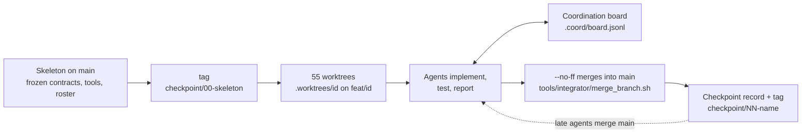

# Development

How this codebase was built, and how to keep developing it. It covers the integrator
plus parallel-agents workflow, what went wrong during the build and how each problem
was handled, the developer tools, code style, the testing strategy, and how to add a
method, a dataset or a dependency.

Related documents:

* [AGENTS_PROTOCOL.md](AGENTS_PROTOCOL.md): the rules every parallel agent follows
  (worktree, owned files, commits, definition of done). This page does not repeat
  them. It describes the integrator's side and the tools.
* [ARCHITECTURE.md](ARCHITECTURE.md): the code itself (pack layout, data flow,
  training loop, ensembles).
* [EXPERIMENT.md](EXPERIMENT.md): the compared methods, their settings and results.
* [REPRODUCIBILITY.md](REPRODUCIBILITY.md): seeds, determinism, hardware, reruns.
* [../CONTRIBUTING.md](../CONTRIBUTING.md): the short guide for human contributors.

Contents:

1. [Day-to-day commands](#1-day-to-day-commands)
2. [How this repository was built](#2-how-this-repository-was-built)
3. [What went wrong and how it was handled](#3-what-went-wrong-and-how-it-was-handled)
4. [Developer tools](#4-developer-tools)
5. [The evidence directory](#5-the-evidence-directory)
6. [Code style](#6-code-style)
7. [Testing strategy](#7-testing-strategy)
8. [Extending the code](#8-extending-the-code)
9. [Dependencies](#9-dependencies)
10. [Running another parallel wave](#10-running-another-parallel-wave)

## 1. Day-to-day commands

Two equivalent ways to run things exist. `make` targets go through `uv run` and are
what CI uses. `tools/dev/*` scripts go through the slot runner `tools/dev/py`, which
the parallel agents had to use on the shared machine (section 4.1). Both use the
settings in `pyproject.toml`.

| Task | Command |
| :-- | :-- |
| Create or update `.venv` from `uv.lock` (CUDA 12.8 torch on Linux) | `make install` (= `uv sync --locked`) |
| CPU-only `.venv` (what CI does) | `make install-cpu`, then `export UV_NO_SYNC=1` |
| Clone the official code at the pinned commit (parity tests only) | `make reference` |
| Download Churn into `data/churn/` | `make download` |
| Lint, format check and the fast tests in one go | `tools/dev/check.sh` |
| Same, restricted to some paths | `tools/dev/check.sh --paths src/tabpack_repro/nn tests/nn` |
| Lint and format check only | `tools/dev/check.sh --fast` or `make lint` |
| Apply ruff fixes and formatting | `make format` |
| Fast CPU tests (CI's `test` job) | `make test` (add `ARGS="-k linear -x"`) |
| Parity tests against the official code | `make test-parity` |
| GPU tests | `TABPACK_GPU=1 tools/dev/py -m pytest -m gpu -q` |
| Every test | `make test-all` |
| Full experiment and summary | `make experiment report` |
| All targets | `make help` |

## 2. How this repository was built

One integrator (the main Claude Code session) wrote a skeleton, then 55 sub-agents
implemented it in parallel, each in its own git worktree, and the integrator merged
their branches. The whole flow:



### 2.1 Skeleton with frozen contracts

Before any agent started, the integrator committed on `main`:

* The scaffold: uv project, Python 3.12, PyTorch from the CUDA 12.8 index.
* Every module of `src/tabpack_repro/` as a **contract**: public classes and functions
  with full signatures, type hints and docstrings that state shapes, dtypes, errors
  and the official semantics to match, and bodies that `raise NotImplementedError`.
  A second pass (`refactor: tighten contracts before parallel implementation`)
  removed ambiguities before the fan-out.
* The shared test harness: `tests/conftest.py` (fixtures), `tests/_helpers.py`
  (synthetic dataset), `tests/parity/conftest.py` (import of the official code), and
  an import smoke test.
* The tools (`tools/dev/py`, `tools/dev/board.py`, `tools/evidence/redact_emails.py`),
  the protocol ([AGENTS_PROTOCOL.md](AGENTS_PROTOCOL.md)), the evidence layout and a
  transcript snapshot taken before any change.
* The roster, [`evidence/coordination/roster.md`](../evidence/coordination/roster.md):
  one row per agent with its id, area, **owned paths** and runtime dependencies.
  Ownership is exclusive, so two agents never edit the same file.

This state was tagged `checkpoint/00-skeleton`. The design decisions made with the
user at that point are in
[`evidence/checkpoints/00-skeleton.md`](../evidence/checkpoints/00-skeleton.md).

Because the contracts were fixed first, an agent could code against a module that did
not exist yet: it read the docstring, and tested with a fake or a monkeypatched
dependency until the real one was merged (for example a21 used a fake pack, a33 a fake
`tabpack.run`, a55 monkeypatched its dependencies).

### 2.2 One worktree and branch per agent

Each agent `<id>` (listed in `.coord/agent_ids.txt`, git-ignored) got a worktree at
`.worktrees/<id>` on the branch `feat/<id>`, created from the skeleton tag, which is
equivalent to:

```bash
git worktree add -b feat/<id> .worktrees/<id> checkpoint/00-skeleton
```

All worktrees share the main checkout's `.venv`. `tools/dev/py` puts the calling
worktree's `src/` first on `PYTHONPATH`, so each agent imports its own code and not
the editable install of the main checkout. The agent's prompt named its id, worktree,
owned paths and task, and told it to read the protocol first. Agents launched later
began with `git merge --no-edit main` to pick up everything merged so far.

### 2.3 The coordination board

Agents talked through `tools/dev/board.py` (section 4.2), an append-only JSON-lines
log at `<main checkout>/.coord/board.jsonl` that every worktree sees. Typical traffic:

* `status` at start and at milestones, `done` with the branch name when finished.
* `question` / `answer` between agents, for example a45 asking a35 for the runner's
  flags so that `EXPERIMENT.md` could document them.
* `blocker` and `finding` for bugs in someone else's files (with a reproduction; the
  owner fixes them, nobody edits files they do not own).
* `contract` from the integrator for skeleton fixes and shared changes, for example
  "merge `checkpoint/00b-data-fix` now" (#60) or "parity deps are installed" (#133).

An agent merged a peer's branch into its own only after the peer posted `done`, which
made integration testing possible before the integrator had merged anything.

### 2.4 Integration: `--no-ff` merges

The integrator merged finished branches into `main` from the main checkout, in
dependency order (for example a03-a06 before a07), with

```bash
tools/integrator/merge_branch.sh feat/a09-nn-linear "LinearPack with per-member init"
```

Every merge is a real merge commit (`--no-ff`) with the subject
`Merge branch 'feat/<id>': <summary>` and the trailers `Agent: <id>` and
`Merged-by: integrator`, so `git log --first-parent main` reads as one line per agent,
and each agent's own commits stay intact on its branch. After a batch of merges the
integrator ran ruff and the test suite on `main` (the checkpoint files record the
results). Nothing was rebased, squashed or
cherry-picked.

### 2.5 Checkpoint tags

After each integration wave the integrator recorded a checkpoint file in
`evidence/checkpoints/` (git state, test results, notes), committed it as
`chore(evidence): record checkpoint NN (name)` and put an annotated tag on that
commit:

| Tag | Commit | Content |
| :-- | :-- | :-- |
| `checkpoint/00-skeleton` | `59203b1` | Scaffold, frozen contracts, test harness, tools, protocol, roster |
| `checkpoint/00b-data-fix` | `e8e129c` | Skeleton fix: anchored `/data/` ignore rule, data package tracked (section 3.1) |
| `checkpoint/01-foundations` | `15ae4cc` | First wave merged: a01-a06, a08-a12, a14, a18-a20, a22 (526 fast tests passing) |

Later checkpoints follow the same pattern (`checkpoint/NN-name`); list them with
`git tag -l 'checkpoint/*' -n1`. A tag with a letter suffix (`00b`) marks a fix to an
earlier checkpoint that running agents must merge.

## 3. What went wrong and how it was handled

### 3.1 The unanchored `data/` ignore rule hid the data package

The skeleton's `.gitignore` had the line `data/`, meant for the dataset directory at
the repository root. Without a leading slash it matches a directory named `data` at
any depth, so it also ignored `src/tabpack_repro/data/` and `tests/data/`. The
package existed in the main checkout, untracked, so everything worked there. But
`checkpoint/00-skeleton` did not contain it, and a new worktree has only tracked
files. In every worktree `tests/conftest.py` (which imports
`tabpack_repro.data.pipeline`) failed with `ModuleNotFoundError`.

Minutes after the launch, five agents reported it on the board with the same
diagnosis and fix: a03 (#6), a04 (#7), a05 (#9), a06 (#14) and a07 (#12, #20).
a02 (#56) and a01 (#57) added that ruff had the same problem: its `extend-exclude`
entry for `data` and ruff's respect for `.gitignore` silently skipped the data
package in `ruff check .` and in the pre-commit hooks. a01 also found that `/data`
does not work in `extend-exclude`; the integrator verified that `data/*` excludes
only the top-level directory (#62). Meanwhile the data agents unblocked
themselves: they copied the stubs from the main checkout and force-added
(`git add -f`) only the files they owned.

The integrator fixed it in `e8e129c` (`fix: track the data package that the data/
ignore rule swallowed`): `.gitignore` now says `/data/`, ruff excludes `data/*`, and
the data stubs are committed. It tagged the commit `checkpoint/00b-data-fix` and told
every running agent to merge the tag (#60). Agents that had force-added owned files
got add/add conflicts and kept their own version. `merge_branch.sh` later resolved the
same conflicts automatically in favour of the branch. Nine minutes passed from the
first report to the fix.

Lesson: before fanning out, check the tag from a checkout that has only tracked files
(section 10, step 3). `git check-ignore -v <path>` shows which rule ignores a path.

### 3.2 At most 20 concurrent sub-agents: rolling launches

The environment runs at most 20 sub-agents at a time, but the roster has 55. The
integrator launched the first 20 and started each remaining agent as soon as a slot
freed up (rolling launches, #63). Agents that depended on one not yet running coded
against its frozen contract and watched `tools/dev/board.py done`. Checkpoint 01
records which agents were running at that time.

### 3.3 API usage-limit interruption

An API usage limit stopped all 20 running agents in the middle of their work. The
board shows the gap: #133 at 14:09 and #134 at 16:52. Nothing was lost, because all
state lives on disk: worktrees, branches, commits and the board. When the limit
lifted, the integrator resumed each of the 20 agents with its previous context
instead of starting new ones. The resumed agents re-read the board
(`read --since <seq>`), merged what had been finished in the meantime, and went on.

### 3.4 Smaller issues

* **Missing parity dependencies.** The official `project.tabpack` imports
  `rtdl_num_embeddings` and `rtdl_revisiting_models` at import time. a18 and a26 had
  to stub those modules in `sys.modules`. Agents may not add dependencies, so the
  integrator added both to the `parity` group (`07af200`, board #133).
* **Contract gaps.** When a contract was unclear, agents posted a `contract` message
  and went on with the most reasonable reading (protocol section 2). Their choices
  are listed in their reports under *Design decisions* and *Open issues*.
* **Memory pressure.** The laptop has about 9 GB of RAM and one 8 GB GPU for all
  agents. A Python process that imports torch uses 0.3-1 GB, so `tools/dev/py`
  limits concurrency (section 4.1).

## 4. Developer tools

### 4.1 `tools/dev/py`: the slot runner

Runs the shared virtualenv's Python for the checkout it is called from (the main
checkout or any worktree), under a machine-wide concurrency slot:

```bash
tools/dev/py -m pytest tests/nn -q
tools/dev/py -m ruff check src tests
TABPACK_GPU=1 tools/dev/py -m pytest -m gpu -q
```

What it does:

* Uses `<main checkout>/.venv` (override: `TABPACK_VENV`), runs from the checkout
  root, and prepends `<checkout>/src` to `PYTHONPATH`.
* Waits for one of `TABPACK_SLOTS` (default 4) slot locks
  (`<main checkout>/.coord/locks/slot-<i>.lock`, `flock`), held until Python exits.
* Hides CUDA (`CUDA_VISIBLE_DEVICES=""`) unless `TABPACK_GPU=1`. GPU jobs also wait
  for the exclusive `gpu.lock`.
* Sets defaults for `TABPACK_DATA_DIR` (`<main checkout>/data`) and
  `TABPACK_REFERENCE_DIR` (`<main checkout>/.reference/tabpack`), so every worktree
  sees the real Churn data and the official clone.
* Sets `OMP_NUM_THREADS=3` (and `MKL_NUM_THREADS` to the same value) and
  `PYTHONDONTWRITEBYTECODE=1`, and stops the process after `TABPACK_TIMEOUT` seconds
  (default 1800).

All of these can be overridden by exporting the variable first.

### 4.2 `tools/dev/board.py`: the coordination board

Stdlib only; the board file is `<main checkout>/.coord/board.jsonl` (override:
`TABPACK_BOARD`). Posting takes an exclusive `flock`, so concurrent posts get unique
sequence numbers.

```bash
tools/dev/board.py post --from a09-nn-linear --kind status "started: LinearPack"
tools/dev/board.py post --from a11-nn-mlp --to a09-nn-linear --kind question "..."
tools/dev/board.py post --from a09-nn-linear --kind done \
  --branch feat/a09-nn-linear "LinearPack ready"
tools/dev/board.py read --for a11-nn-mlp   # messages to a11, to all, or from a11
tools/dev/board.py read --since 120        # only messages with seq > 120
tools/dev/board.py read --kind done        # also: --from <id>
tools/dev/board.py status                  # latest status/done/blocker per agent
tools/dev/board.py done                    # every 'done' message
```

Kinds: `status`, `question`, `answer`, `done`, `blocker`, `contract`, `review`,
`finding`. `--to` defaults to `all`.

### 4.3 `tools/dev/check.sh`: is this checkout healthy?

Runs `ruff check`, `ruff format --check` and `pytest -q -m "not slow and not gpu"`,
each through `tools/dev/py`, on the checkout the script lives in, whatever the current
directory. All steps run even after a failure, and a summary follows. Exit status: 0
if every step passed or was skipped, 1 if a step failed, 2 on a usage error.

* `--fast` skips pytest.
* `--paths PATH...` restricts the check. Ruff gets directories and the files it
  understands. Pytest gets directories and `test_*.py` files under `tests/`. Explicit
  paths are checked even if `pyproject.toml` excludes them.

### 4.4 `tools/integrator/merge_branch.sh`

`tools/integrator/merge_branch.sh <branch> "<summary>"` merges one agent branch into
the current branch with `--no-ff` and the message format of section 2.4. Add/add
conflicts (`AA`) are resolved in favour of the branch; any other conflict aborts the
merge and exits 1 for manual resolution. Only the integrator runs it, on `main` in the
main checkout.

### 4.5 `tools/evidence/*`

Scripts that turn the build history into the files of section 5. All but
`redact_emails.py` come from agent a52; see each script's `--help` or header comment.

| Script | Purpose |
| :-- | :-- |
| `redact_emails.py FILE...` | Replace personal email addresses with `[redacted-email]` in place (keeps `git@github.com`, `noreply@anthropic.com`, `*@users.noreply.github.com`); prints sha256 before and after |
| `snapshot_session.sh before\|after` | Copy the integrator's session transcript to `evidence/<which>/session.jsonl` and redact it |
| `record_checkpoint.sh NN name [--notes FILE] [--no-tests]` | Write `evidence/checkpoints/NN-name.md` (history, merged branches, fast tests, board status) and the cumulative diff; it never commits or tags |
| `export_branch_diffs.sh [BRANCH...]` | Write one diff per merged `feat/*` branch into `evidence/diffs/` |
| `archive_board.py` | Copy the board to `evidence/coordination/board.jsonl` (redacted) and render `board.md` |
| `collect_reports.py` | Build `evidence/agents/INDEX.md`, one row per agent report |
| `selftest.sh` | Run every evidence tool against a throwaway repository |

### 4.6 Makefile, CI, pre-commit, editorconfig

* `Makefile`: the targets of section 1. `make help` lists them with their variables
  (`ARGS`, `RUN`, `FAST_MARKERS`, `REFERENCE_DIR`, `RUNS_DIR`, `RESULTS_DIR`).
* `.github/workflows/ci.yml`: three jobs on pushes and pull requests to `main`.
  * `lint`: `make lint` with the ruff version pinned in `uv.lock`.
  * `test`: `make install-cpu` and `make test`.
  * `parity`: `make install-cpu`, `make reference` and `make test-parity`.

  CI has no GPU and no Churn data, so `gpu` and `data` tests skip there.
* `.pre-commit-config.yaml`: whitespace and end-of-file fixers, YAML/TOML checks,
  merge-conflict markers, a 1 MiB file-size limit, `ruff-check --fix` and
  `ruff-format`, with ruff pinned to the `uv.lock` version. Enable it with
  `uvx pre-commit install`. Worktrees share `.git/hooks`, so this enables the hooks
  in every worktree. `evidence/` is excluded from the fixers, because its files must
  stay byte-exact.
* `.editorconfig`: UTF-8, LF, final newline. 4-space Python with max line 88, 2-space
  YAML/TOML/JSON/Markdown/shell (4-space `pyproject.toml` and `uv.lock`), tabs in the
  Makefile. Nothing under `evidence/` is touched.

## 5. The evidence directory

`evidence/` records how the repository was built.
[`evidence/README.md`](../evidence/README.md) documents it. In short:

| Path | Content | Written by |
| :-- | :-- | :-- |
| `before/session.jsonl`, `after/session.jsonl` | Integrator transcript at the start and at the end (emails redacted, sha256 in the README) | `snapshot_session.sh` |
| `checkpoints/NN-name.md` | One file per checkpoint tag | integrator / `record_checkpoint.sh` |
| `diffs/` | One `.diff` per merged agent branch and per checkpoint | `export_branch_diffs.sh`, `record_checkpoint.sh` |
| `agents/<id>.md` | Each agent's report (sections defined in protocol section 6) | the agent; `INDEX.md` by `collect_reports.py` |
| `coordination/` | `roster.md`, the archived board (`board.jsonl`, `board.md`) | integrator / `archive_board.py` |
| `commits.log` | `git log --graph` of the final history | integrator |

`evidence/` is excluded from ruff, the pre-commit fixers and editorconfig. Never
reformat these files by hand.

## 6. Code style

Ruff, configured in `pyproject.toml`, is the only linter and formatter:

* `line-length = 88`, `target-version = "py312"`.
* Lint rules: ruff's defaults plus `I` (import sorting), `UP` (pyupgrade), `E501`
  (line length), `B` (bugbear) and `RUF`.
* `quote-style = "single"`: single quotes for strings; docstrings keep `"""`.
* Excluded: `.worktrees`, `.reference`, `evidence/*`, `data/*`, `runs/*`.

Every commit must pass `ruff check` and `ruff format --check` for the files it touches.

Conventions followed across `src/`:

* `from __future__ import annotations` at the top of every module that has code.
  Modern type syntax: `X | None`, `list[int]`, `collections.abc` types.
* Type hints on every public function, method and attribute. Options are
  keyword-only (`*`). Config and record dataclasses use `kw_only=True`.
* **Docstrings are the contract.** A module docstring names the component and its
  author, for example `"""LinearPack (a09): K independent linear layers ..."""`. A
  public docstring states shapes (in the `(K, B, d)` convention of
  `tabpack_repro/types.py`), dtypes, devices, errors, and which official behaviour it
  matches. Implementers add a `Details (aNN):` paragraph instead of rewriting the
  contract. If code and docstring disagree, it is a bug. A change of behaviour
  updates the docstring in the same commit.
* Errors: `ValueError` for bad values, `TypeError` for wrong types,
  `NotImplementedError` only for documented out-of-scope features (for example
  regression in `build_dataset`). Messages name the offending argument or config key.
* No `print` in the library. Modules that report progress use
  `logger = logging.getLogger(__name__)`.
* Private helpers start with `_`. Public names are frozen contracts (section 8.3).
* Comments explain *why*, and name official functions by module and name
  (`lib.data.build_dataset`). Code from the official repository is never copied into
  `src/` (protocol section 7).

## 7. Testing strategy

`pytest` settings in `pyproject.toml`: `testpaths = ["tests"]`,
`pythonpath = ["src", "tests"]`, `--import-mode=importlib` and `--strict-markers`
(an unregistered marker is an error).

### 7.1 Kinds of tests

* **Unit tests, one file per module**: `tests/<package>/test_<module>.py` mirrors
  `src/tabpack_repro/<package>/<module>.py` (`tests/test_<module>.py` for top-level
  modules), owned by the module's author. They run on CPU with small shapes in a few
  seconds, use `make_synthetic_dataset` (`tests/_helpers.py`) or a tiny on-disk
  dataset in `tmp_path`, and check the contract: shapes, dtypes, errors, edge cases,
  and equivalence to a naive reference (for example a pack of K members against K
  independent `nn.Linear` layers or `torch.optim.AdamW` runs).
* **Parity tests**: `tests/parity/test_parity_{nn,optim,ensemble,data,sampler}.py`
  compare our code with the official implementation on identical inputs (copied
  weights, same seeds, same data). The session fixture `official` adds
  `$TABPACK_REFERENCE_DIR/src` to `sys.path` and returns an importer
  (`official('project.nn')`). Every test under `tests/parity/` is marked `parity`
  automatically and skips if the clone is missing. Comparisons are bit-exact
  (`torch.equal`) where possible; any tolerance and its reason are stated in the test
  module's docstring. A few parity checks sit in unit-test files with an explicit
  `@pytest.mark.parity`.
* **Integration tests**: in `tests/integration/`, `test_end_to_end.py` runs the
  methods and the CLI on small data, `test_determinism.py` checks that equal seeds
  give equal results, and `test_pack_invariants.py` checks pack-level invariants
  (a pack equals K independently trained models, removing a member does not change
  the others, checkpoints restore exactly).

### 7.2 Markers and fixtures

| Marker | Meaning | How it skips |
| :-- | :-- | :-- |
| `gpu` | Needs CUDA | The `cuda_device` fixture skips without CUDA; `tools/dev/py` hides CUDA unless `TABPACK_GPU=1` |
| `parity` | Imports the official code | The `official` fixture skips without the clone |
| `slow` | Slower integration test | Deselected by the fast suite |
| `data` | Needs the real Churn data | The `churn_dir` fixture skips when `churn/info.json` is missing under `$TABPACK_DATA_DIR` (default `data/`) |

A test with one of these needs uses both the marker (for selection) and the fixture
(for skipping). Common selections:

```bash
tools/dev/py -m pytest -q -m "not slow and not gpu"  # fast suite (check.sh, CI)
tools/dev/py -m pytest tests/parity -q               # parity (make test-parity)
TABPACK_GPU=1 tools/dev/py -m pytest -m gpu -q       # GPU only
tools/dev/py -m pytest -m data -q                    # real-data tests
```

`tests/conftest.py` and `tests/parity/conftest.py` are shared. During a parallel wave
only the integrator changes them; request changes on the board.

## 8. Extending the code

### 8.1 Adding a method

A method is a function `run(config, output_dir) -> dict` that writes a run directory.
Implement these contracts:

1. **Config** in `src/tabpack_repro/config.py`: a `@dataclass(kw_only=True)` with
   `method: Literal['<name>'] = '<name>'`, a `seed`, and the sections it needs
   (`data: DataConfig`, `training: TrainingConfig`, a model and an optimizer config).
   Add the name to `MethodName`, the class to `AnyMethodConfig` and to
   `CONFIG_CLASSES`. `config_from_dict`, `load_config` and `dump_config` are driven
   by the type hints and normally need no change.
2. **Run function** in `src/tabpack_repro/methods/<name>.py`:
   `run(config, output_dir: str | Path) -> dict[str, Any]`. Use `methods/common.py`:
   `setup_run(seed, config.data, config.training)` (seeding, device, dataset, autocast,
   score functions, env), `base_report(...)` for the common fields, `best_member(...)`,
   and `write_run(output_dir, report, predictions, config)`, which writes
   `report.json`, `predictions.npz` (exactly `val` and `test`, stored as float32
   probabilities for classification) and `config.toml`. The report must follow the
   schema in `methods/report.py` (`RUN_REPORT_SCHEMA_DOC`), including
   `metrics.val.score` and `metrics.test.score`, which the summary reads.
3. **Config file** `configs/churn/<name>.toml` with every key written out and
   commented, like the existing files. `tests/test_config.py` requires the exact set
   of files, so add the new one to `EXPECTED_FILES` there.
4. **Wiring**: the `run` subcommand's method table in `src/tabpack_repro/cli.py`, the
   method list in `scripts/run_churn.py`, and `METHOD_ORDER` plus the display name in
   `src/tabpack_repro/reporting/summarize.py`. Unknown methods are still summarized,
   but sorted after the known ones and shown by their raw name.
5. **Tests**: `tests/methods/test_<name>.py` (synthetic data; one `@pytest.mark.data`
   smoke test on Churn), and determinism coverage in `tests/integration/`.
6. **Docs**: a subsection in [EXPERIMENT.md](EXPERIMENT.md) section 3 and in
   [ARCHITECTURE.md](ARCHITECTURE.md) section 8.

### 8.2 Adding a dataset

The data layer is generic; the experiment scripts are Churn-specific.

1. **Files** in the official layout (docstring of `data/dataset.py`): `info.json` with
   `{"task": {"type": ..., "score": ...}}`, optional `x_num.npy` / `x_bin.npy` /
   `x_cat.npy`, `y.npy`, and `splits/default/{train,val,test}.npy` with row indices.
   A dataset from the official bundle is fetched with
   `tabpack-repro download --name <name>` (`download_dataset` extracts
   `data/<name>/` from the sha256-pinned bundle). Any other dataset goes into
   `$TABPACK_DATA_DIR/<name>/` by hand.
2. **Task support**: binclass (`accuracy`, `roc-auc`, `log-loss`) and multiclass
   (`accuracy`, `log-loss`) work (`metrics.py`). Regression raises
   `NotImplementedError` in `build_dataset`. Supporting it needs label
   standardization in `data/pipeline.py` and predictions in label units
   (`PredictionType.LABELS`), which is a contract change (section 8.3).
3. **Configs**: `configs/<name>/*.toml` with `[data] path = "<name>"`. The default
   TabPack `space` in `config.py` is the official *Churn* search space. Take the
   dataset's own space from the official config and set it in the TOML file.
4. **Scripts and reporting**: `scripts/run_churn.py` has `DATASET = 'churn'` and Churn
   paths, and `reporting/reference.py` extracts only the official Churn numbers.
   Generalize or copy them for the new dataset.
5. **Tests**: add the dataset to the synthetic edge cases and, if it is in the
   official bundle, to `tests/parity/test_parity_data.py`.

### 8.3 Changing a frozen contract

Public names, signatures and documented semantics in `src/tabpack_repro/**` are
contracts that other modules, tests and docs rely on.

* During a parallel wave, only the integrator changes them. Agents post a `contract`
  message on the board instead (protocol section 2).
* Otherwise, change the docstring, the implementation, every caller and the tests in
  one pull request. Mark it with `!` in the commit type (for example `feat(config)!:`).
  Update [ARCHITECTURE.md](ARCHITECTURE.md) and [EXPERIMENT.md](EXPERIMENT.md) where
  they describe the contract.
* If the change alters `report.json`, bump `RUN_REPORT_SCHEMA_VERSION`
  (`methods/report.py`). If it alters `summary.json`, bump `SUMMARY_SCHEMA_VERSION`
  (`reporting/summarize.py`).

## 9. Dependencies

`pyproject.toml` and `uv.lock` define the environment. Always change them with uv and
commit both files together:

```bash
uv add 'somepkg>=1.2,<2'              # runtime dependency
uv add --group dev 'sometool>=3,<4'   # test or lint tool
uv add --group parity 'pkg>=0.1,<1'   # only needed to import the official code
uv lock --upgrade-package torch       # bump a locked version within its range
```

* **Ranges**: follow the existing style, a lower bound plus a major-version cap.
* **Groups**: `dev` has pytest and ruff. `parity` has what the official code imports
  (`delu`, `loguru`, `rtdl-num-embeddings`, `rtdl-revisiting-models`), and nothing in
  `src/` may import it. `[tool.uv] default-groups` installs both.
* **torch** comes from the explicit `pytorch-cu128` index on Linux
  (`[tool.uv.sources]`), so `uv.lock` pins a `+cu128` build. `make install-cpu`
  (CI) installs the same version from the CPU index and drops `torch`, `triton`,
  `nvidia-*` and `cuda-*` from the locked requirements. A new dependency that needs
  CUDA packages would therefore break CI's `uv pip check`.
* **ruff**: when `uv.lock` bumps ruff, update `rev` of the ruff hook in
  `.pre-commit-config.yaml` to the same version.
* `make install` runs `uv sync --locked`, which fails when `uv.lock` does not match
  `pyproject.toml`. CI exports the lock with `--frozen`, which does not check it, so
  a stale lock would silently be used there. Run `uv lock` and commit both files.
* Use the commit type `build`, for example
  `build(parity): add the official code's embedding packages to the parity group`.
* During a parallel wave, agents never run `uv add`, `uv sync` or `pip install`: all
  worktrees share one `.venv`. They ask the integrator on the board, and the
  integrator installs and locks the package on `main` and announces it (#133).

## 10. Running another parallel wave

To build the next large change the same way:

1. **Contracts on `main`.** Write or extend the stubs (signatures, type hints,
   docstring contracts, `raise NotImplementedError`), the shared fixtures, and the
   configs they need. Tighten ambiguous docstrings before anyone starts.
2. **Roster.** Add a table like
   [`evidence/coordination/roster.md`](../evidence/coordination/roster.md): one agent
   per module or document, exclusive owned paths (implementation, tests, and
   `evidence/agents/<id>.md`), and runtime dependencies. Keep shared files
   (`pyproject.toml`, `uv.lock`, `conftest.py`, existing `__init__.py`) with the
   integrator.
3. **Check the tag as agents will see it.** Commit, run `tools/dev/check.sh`, make sure
   `git status --ignored --short src tests` lists nothing but caches, and run the
   check again in a scratch worktree created from the commit (it contains only
   tracked files, like the agents' worktrees). Then tag it:
   `git tag -a checkpoint/NN-name -m "..."`.
4. **Worktrees and launch.** `git worktree add -b feat/<id> .worktrees/<id> <tag>` per
   agent. Launch at most 20 at a time, leaves of the dependency graph first. Each
   prompt names the id, worktree, owned paths and task, and points to
   [AGENTS_PROTOCOL.md](AGENTS_PROTOCOL.md).
5. **Supervise through the board.** `tools/dev/board.py status` and `done` show
   progress. Answer `contract` and `blocker` messages quickly. Fix a skeleton bug with
   a new commit and tag (`checkpoint/NNb-...`) that agents merge. If agents are
   interrupted, resume them with their context rather than starting new ones.
6. **Merge** each branch whose agent posted `done`, in dependency order, with
   `tools/integrator/merge_branch.sh`, and run `tools/dev/check.sh` on `main` after
   each batch.
7. **Record the checkpoint.** Run `tools/evidence/record_checkpoint.sh NN name`,
   `export_branch_diffs.sh`, `archive_board.py` and `collect_reports.py`. Review the
   output, commit it as `chore(evidence): record checkpoint NN (name)`, tag it, and
   push `main`, the `feat/*` branches and the tags.
